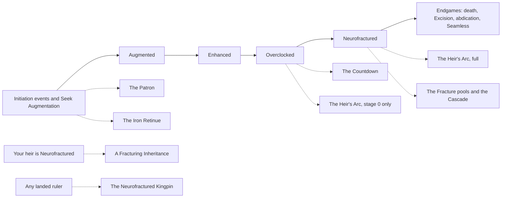
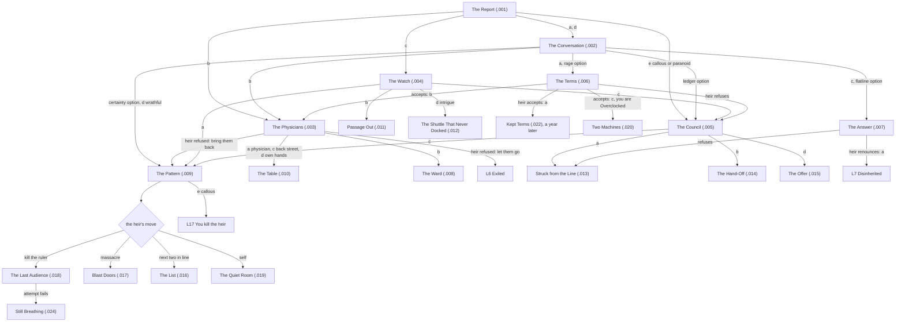
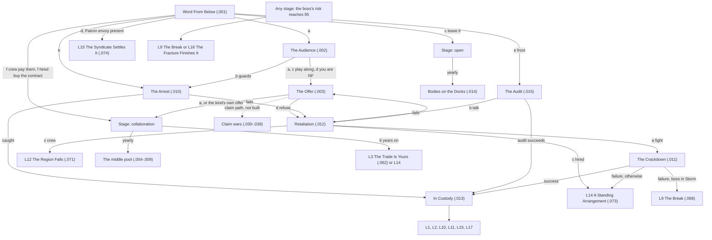
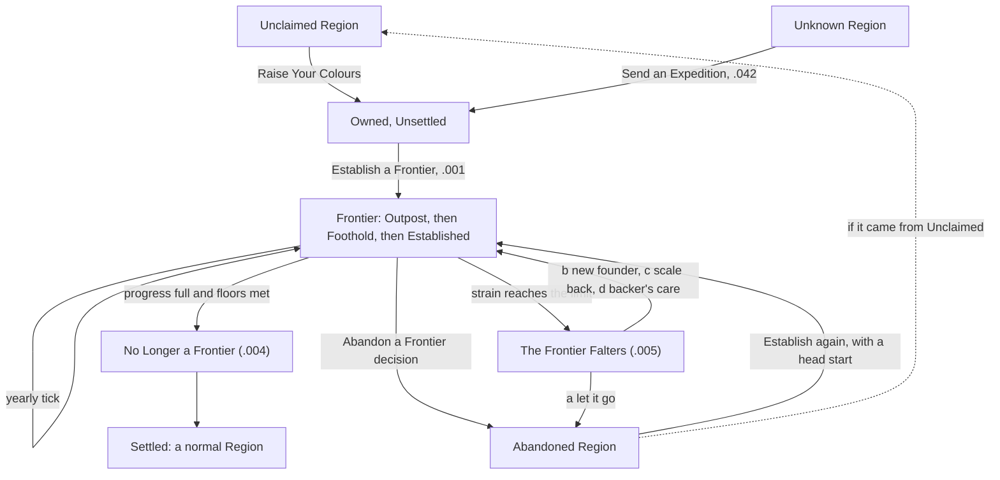

# Story chains: a reader's guide

**For:** the owner. This is a plain-language guide to every long, branching story in the mod, not a build spec.
**Written by:** eotg-architect, 2026-10-09, from the script and loc on `v2-space-map` (commit 1012c3e). Where the script and a spec disagree, this guide follows the script and says so. Unbuilt parts come from the specs and are marked **not built**.

**How to read the flows:** an arrow means "leads to". The text in parentheses is the event id, which you can fire from the console with `event <id>` in debug mode. Option letters (a, b, c...) are the order the options appear in the event. "[brave]" means the option shows only for a ruler with that trait. A Mermaid chart renders in VS Code's Markdown preview (Ctrl+Shift+V).

**A word on "risk".** Most cybernetics chains turn on one hidden number per character, `eotg_fracture_risk` (0 to 100). The player never sees it. It shows up as three "bands" that change the text and the odds: **Flicker** (low), **Fracture** (middle) and **Storm** (high, 60+). At 95 or more, a Neurofractured ruler hits the terminal event. When this guide says "calms" or "worsens" someone, it means that number goes down or up.

---

## Index

**Cybernetics**
0. [How the cybernetics chains connect](#0-how-the-cybernetics-chains-connect)
1. [A Fracturing Inheritance](#1-a-fracturing-inheritance): the ruler's heir is breaking
2. [The Neurofractured Kingpin](#2-the-neurofractured-kingpin): the boss under your capital is breaking (batch A live, batch B not built)
3. [The Heir's Arc](#3-the-heirs-arc): the heir watches the ruler break
4. [The Patron and the Reprisal](#4-the-patron-and-the-reprisal): somebody paid for your implants
5. [The Countdown](#5-the-countdown): the slide from Overclocked to the cascade
6. [The Fracture and the endgames](#6-the-fracture-and-the-endgames): Neurofractured life, the Cascade, Excision, Seamless, abdication
7. [The Iron Retinue](#7-the-iron-retinue): augmentation spreads to your knights
8. [Shorter chains (2 to 3 events)](#8-shorter-chains-2-to-3-events)

**Frontier**

9. [The Frontier lifecycle](#9-the-frontier-lifecycle): Unclaimed, claimed, established, settled or abandoned

[Status summary](#status-summary)

---

## 0. How the cybernetics chains connect

A character climbs the ladder Augmented, Enhanced, Overclocked, and may break into **Neurofractured**. From there they end in death, Excision (everything cut out), abdication, or **Seamless** (Total Integration: the implant runs them for good). Each big chain hangs off one rung:

The Inheritance and the Kingpin do not need the ruler to be augmented at all: they are about someone else's implant.

---

## 1. A Fracturing Inheritance

### Premise
You are sound. Your heir is not. Word reaches you that your primary heir has become Neurofractured: their implant now runs a model of them a half-beat ahead, and they have started to act on it. You decide what the dynasty does about it, over three to seven events: talk, treat, confine, exile, disinherit, abdicate, or wait and see what the heir does first. The worst endings are the ones the heir chooses: they may kill you, massacre your court, or murder the next two people in the line of succession. The heir's own hidden risk is the resource here. Whatever you do in the middle can calm the heir or make them worse, and a worse heir is more dangerous at the end.

### How it starts
- **Who:** a landed adult ruler, free, not Seamless, whose **primary heir** is Neurofractured, an adult, an AI character, unlanded, living at the ruler's court and not imprisoned. A given heir only ever starts this once.
- **When:** the yearly check. A player ruler gets it the first year it is true. AI rulers are throttled (40% a year for counts, 55% for dukes, 70% for kings and up).
- **Also:** the moment the heir breaks. When a courtier who is your primary heir cascades into Neurofractured, this tree starts at once, in place of the generic "Broken Champion" notice.
- **Limits:** a 3-year cooldown on the ruler; it waits while a live Heir's Arc (chain 3) is running, and the Heir's Arc can't start while this runs.
- **Player vs AI:** only a **player** ruler sees the tree. For an AI ruler, one hidden event (`eotg_aug_inherit.028`) picks an ending by weighted roll 30 to 180 days later and applies the same consequences, so the map shows the same results.
- **Debug:** `effect primary_heir = { add_trait = eotg_neurofractured }`, then `effect eotg_aug_inherit_start_effect = { SOURCE = report }`. Force the variation with `effect eotg_aug_inherit_debug_effect = { PROFILE = rage BOND = dutiful THREAT = none }`, and force every hidden roll to pass or fail with `effect set_variable = { name = eotg_inh_force value = flag:pass }`. Full recipes per ending: `cybernetics_v2_fracturing_inheritance.md` §9.1.

### Variation
At the start the game rolls two things and keeps them for the whole chain.
- **Profile** (how the break shows):
  - **Running Hot:** rages and breakage, then apologies. Most likely to massacre.
  - **The Ledger:** lists of who stands where and who is next. Most likely to murder the next two in line.
  - **Flatline:** cold, polite, empty. Most likely to accept terms, renounce, or end their own life. Never turns violent when struck from the line.
  - **Certainty:** gives orders as if already ruling. Most likely to come for you.
- **Bond** (what the heir is to you): rival, estranged, claimant, favourite or dutiful. It shifts every roll (a favourite accepts terms; a rival comes for you).
- **Your traits** gate 13 options (compassionate, callous, paranoid, wrathful, brave, sadistic, just, vengeful, arbitrary, forgiving; physician training or learning 14+; intrigue 14+ or deceitful; being Overclocked yourself).

That gives 20 different openings, and each changes the text of the first event, which option shows in The Conversation, what the watcher saw, and the heir's words at the end.

### Flow
Three loop guards keep it short: The Pattern, The Terms and The Physicians each run at most once. A route back into one that has already run goes straight to the heir's move instead.

The rest, in words:
- **The Pattern (.009)** shows you what the heir is building (the threat is rolled from profile and bond). **a** arrest them: success sends them to the ward; failure brings the threat in days. **b** double the guard and wait. **c** talk them down: success leads to The Terms. **d** [brave] let it come to you (you are ready). **e** [callous or sadistic] kill the heir first.
- **The Ward (.008)**, house arrest or chains, then a hidden breakout roll: most heirs stay locked away (**The Locked Wing, .023**), but a breakout leads to the massacre (**Blast Doors, .017**, "the ward's door was found open").
- **The Table (.010)**: surgery. **a / b** begin (b [compassionate] you stay beside them). **c** step back, which leads to The Pattern. The result comes in **After the Table (.021)**.
- **Struck from the Line (.013)**: the heir is disinherited, then reacts: accepts, leaves, or turns violent. Violent: post guards (the threat comes anyway), lock them up, or [callous] end it.
- **The Hand-Off (.014)**: you step down, as warden (a) or quietly (b). The player becomes the heir, and **The Warden's Hand (.026)** is the first thing they see, three days later.
- **The Offer (.015)**: the next in line offers to remove the heir. **a** don't tell me: they do it. **b** refuse: they may do it anyway, else The Pattern. **c** [just] say it to the heir's face: back to The Pattern, now aimed at the next two.
- **The Last Audience (.018)**: the heir comes for you. Three stances, one hidden roll. Success: you die and the player continues as the heir in **The Seat (.025)**. Failure: **Still Breathing (.024)**: execute them, lock them up, or [forgiving] forgive them (which becomes the terms ending).

### Outcomes (17)
| # | Ending | Reached by | What happens |
|---|---|---|---|
| L1 | Clean excision | The Table, roll goes well (.021) | The heir survives with every implant gone (recovery, a scar), still your heir. |
| L2 | Maimed | The Table, partial success (.021) | As L1, plus the maimed trait. |
| L3 | Dies on the table | The Table, roll fails (.021) | The heir dies under the knife. Odds depend on who operates: physician, back street, or your own hands. |
| L4 | Kept terms | The Terms accepted; Two Machines b; Still Breathing c | The heir is sedated and reassured. You carry a 10-year "terms" modifier (vassals doubt the succession, a little stress and prestige drag). A year later Kept Terms reports: holding, or slipping. |
| L5 | Confined | The Ward, or a lock-up option, with no breakout | The heir stays imprisoned in The Locked Wing (.023). |
| L6 | Exiled | Passage Out; the heir refuses physicians and you let them go; the heir leaves after being struck | The heir leaves court for good (to the pool). Option c of Passage Out also disinherits. |
| L7 | Disinherited | The Answer (heir renounces); Struck from the Line, accepted | Vanilla disinheritance. Renouncing costs you no prestige; striking them out costs some. |
| L8 | Lost in transit | The Shuttle That Never Docked, a | The heir is reported dead in a shuttle accident and quietly removed. A witness may expose it (a toast). Flags are kept for a future "they come back" event (not built). |
| L9 | Abdication under a warden | The Hand-Off, a | You step down; the heir rules with you as regent (if a regency can start). Play passes to the heir. |
| L10 | Quiet abdication | The Hand-Off, b | You step down with no warden. Play passes to the heir. |
| L11 | The next in line acts | The Offer a, or b when they act anyway (.027) | The heir is murdered by the second in line. You let it stand, arrest them, or execute them. |
| L12 | The heir's own end | The heir's move is "self" (.019) | Flatline: suicide. Other profiles: a cascade death. You choose what the court is told. |
| L13 | The next two in line | The heir's move is "next two" (.016) | The heir murders the two people after them in the line (places 1 to 6, AI only, never a player). If you were guarded, a victim at court may survive wounded. Then: custody, execution, or keep them as heir anyway. |
| L14 | The massacre | The heir's move is "massacre", or a ward breakout (.017) | 1 to 4 courtiers die, one is wounded and named; you get an "emptied court" modifier for 5 years. Then take the heir alive, cut them down, or hold them until it passes. |
| L15 | The heir kills you | The Last Audience, attempt succeeds | You die (murder, the heir as killer). Play passes to the heir, who sees The Seat (.025). |
| L16 | You choose Neurofracture | Two Machines a (you must be Overclocked) | You cascade on purpose to meet the heir where they are. The heir calms; you are now Neurofractured, and the Fracture chain (6) is yours. |
| L17 | You kill the heir | The Pattern e; Struck c; The List b; Blast Doors b; Still Breathing a | The heir dies by your order (secret murder, execution, or the guards). You may become a kinslayer. |

### Status
**Built** (commit 995d43d): all 28 events, the AI resolution and 15 shared ending effects. Static QA passed. **Not yet seen in game** (CB-45). Not built by design: landed or foreign heirs, a player heir, the faked-death return, notices to other players about an AI's outcome (spec §10).

---

## 2. The Neurofractured Kingpin

### Premise
Somebody runs the lower levels of your capital: a street crew, a syndicate's local business, a clinic that is really a front, or a hired crew between contracts. Their boss has gone Neurofractured. The boss is dangerous, useful and failing, and controls the crime under your seat. You can execute them cheaply, clean the streets properly, take their money, let them run errands for you, or (in batch B, not built) put their guns behind a claim on your liege's title. The **boss's** hidden risk drifts up every year, so ignoring them ends in a massacre or their own cascade. This is the one cybernetics story you can see on the story panel: it shows the boss and how deep their hold on you is (three bands: "A favour owed", "Deep in their pocket", "They own the room"), never a number.

### How it starts
- **Who:** a landed ruler of count tier or above, adult, free, not a landless adventurer, whose capital has development 10 or more.
- **How often:** 2% a year. Doubled with a Patron debt, and higher if you are augmented, your realm bans implants, you carry illegal implants, or your court has augmented people. AI rulers ×0.25. Typical play: once or twice a campaign.
- **Limits:** once per life, a 10-year cooldown, one at a time.
- **On your death:** the story passes to your player heir, with the boss's hold loosened a little, and the heir sees **The Inheritance (.040)**.
- **Debug:** the decision **"Debug: Start the Boss Below"** (debug mode only) ends any running copy, clears the once-per-life flag, and sends Word From Below within a day. To force a profile first: `effect set_variable = { name = eotg_kp_force_kind value = flag:front }` (also `_method`, `_reach`, `_mind`).

### Variation
Rolled at the start and stored on the boss: **96 combinations**.
- **Kind** (what the organization is). Crew: the streets. Syndicate: money (only exists if you have a Patron, and it is the Patron's own syndicate). Front: files. Hired crew: guns. Each kind has its own options and some exclusive endings.
- **Method:** violence, bribery, blackmail or infiltration. It picks which errand they ask for and how a failed arrest goes.
- **Reach:** local or wide. Wide is harder to arrest and pays and costs more.
- **Mind** (how the break shows): purge (turns on their own people), grandeur (wants to be seen), forecast (warns you about themselves), cold (prices everything). It picks the Episode's version and leans the endings.

### Flow
Live in batch A unless marked **not built**.

The rest, in words:
- **Stage "open"** (you left it): each year, 60% **Bodies on the Docks (.014)** (send the guard, bring them in to talk, or ignore it again; a crew boss in Storm may then seize a Region), 20% **The Lieutenant (.009)**, 20% nothing.
- **Stage "collaboration"** (you made a deal): at most one event a year from the **middle pool**, picked by profile:
  - **The Ledger (.004):** your share of the takings (syndicate or bribery).
  - **The Errand (.005):** by method: let a named courtier be killed, keep a blackmail file, seat their person at your court, or wave a cargo through. You can refuse, or arrest the ones sent.
  - **The Episode (.006):** by mind: hand over a courtier the implant is fixed on, give them a public seat, take their warning, or pay their itemized cost.
  - **The Informant (.007):** someone at court is leaking to them (infiltration): arrest, turn or ignore.
  - **The Protection Bill (.008):** pay, refuse (arson in your capital), or send the guard in.
  - **The Lieutenant (.009):** a lieutenant offers to sell out the boss: use it (leads to the arrest), warn the boss (the lieutenant dies), or ignore it.
  Taking money and running errands deepens their hold; refusals, turning their people and gathering evidence loosen it. After 6 years the deal ends on its own: **The Trade Is Yours** if their hold is light and they are a syndicate or front (or in Storm), else **A Standing Arrangement**.
- **In Custody (.013):** **a** execute now (L1), **b** public trial (L2), **c** bring them inside your court (L11), **d** give them a Region (L10), **e** [front] seize the clinic (L17), **f** [syndicate] hand them to the syndicate (L15).
- **Not built (batch B):** the claim path from The Offer (back the boss's claim on your liege's title, or your own claim with their guns; for independent rulers, a neighbour's seat or a vassal's seat); The Claim (.030), The Neighbour's Seat (.031), The Vassal's Seat (.032), The War Below (.033), Turned Guns (.034), The Partner's Price (.036), Now or Never (.038), Word From the Docks (.039, tells a player liege); The Hold Closes (.072, when their hold reaches "They own the room"); The Orders (.050, the "kept" crisis stage); The Turn (.067, when you refuse twice); and the front's "let them publish" option at Retaliation.

### Outcomes (17 leaves, plus quiet ends)
| # | Ending | Reached by | What happens | Live? |
|---|---|---|---|---|
| L1 | A Quick Ending (.060) | Custody a | Executed under your law; small prestige and dread; the organization splinters (capital loses control for 2 years). | yes |
| L2 | The Streets Go Quiet (.061) | Custody b | Trial, then execution or life in the cells; prestige; capital "streets cleared" for 10 years; every vassal +10 opinion. | yes |
| L3 | The Trade Is Yours (.062) | 6-year deal, hold light | The boss cascades and dies; their business is yours: keep it (tax up, vassals uneasy, 20 years), burn the ledgers (vassals approve), or [greedy] expand it (tyranny). | yes |
| L4 | Kingmaker (.063) | Won claim war (backing the boss) | The boss holds your liege's title and rewards you. | **not built** |
| L5 | Before the Bill Came (.064) | Won your own claim, then killed the boss | Secret murder of your partner. | **not built** |
| L6 | Sold to the Winner (.065) | Lost claim war | The boss sells you to the winner. | **not built** |
| L7 | Every Level Burning (.066) | War drags on 3+ years | Civil war spiral; both capitals burn. | **not built** |
| L8 | The Turn (.067) | Refusals, or exposure | The boss sells you out to your liege (or arms your angriest vassal). | **not built** |
| L9 | The Break (.068) | Boss reaches 95 risk; failed crackdown in Storm | Massacre in the lower levels (1 to 2 named dead, capital scarred 10 years); you hunt the boss, seal the levels, or go down yourself. If you were in league with them, vassals resent it. | yes |
| L10 | A Seat Under You (.069) | Custody d | The boss becomes your landed vassal (a non-capital county); vassals dislike it. The Neurofractured ruler events now run on them. | yes |
| L11 | Brought Inside (.070) | Custody c | The boss becomes your courtier on a short lead; you get a hook and fewer hostile schemes succeed. | yes |
| L12 | The Region Falls (.071) | Crew only: Retaliation c; Bodies on the Docks ignored in Storm | The crew holds a county as an independent ruler; you keep a pressed claim to take it back. | yes |
| L13 | The Hold Closes (.072) | Their hold reaches "They own the room" | The localized crisis: you obey, and The Orders follow yearly. | **not built** |
| L14 | A Standing Arrangement (.073) | Long deal; failed crackdown; hired crew bought out | You pay tribute (tax down 10 years); the streets stay quiet. [just] option plants a grudge for later. | yes |
| L15 | The Syndicate Settles It (.074) | Patron's envoy asked (.001 d); Custody f | The syndicate removes its own boss; you owe the Patron one more demand. | yes (needs a Patron) |
| L16 | The Fracture Finishes It (.075) | Boss reaches 95 risk | The boss dies of the cascade; the aftermath depends on the kind (loose ends, a stray cargo of gold, idle guns). | yes |
| L17 | The Clinic Changes Hands (.076) | Front only: Custody e | You seize the clinic: it becomes your clinic of record; execute the boss or let them run it for you. | yes |
| - | Quiet ends | Another ruler hires the boss; the boss dies outside the story; you lose your land or are imprisoned | A toast, or nothing, and the story ends. | yes |

### Status
**Batch A built** (commit 60db01f): 27 events, 11 of the 17 leaves, the visible panel and the hand-off to the heir. Static QA passed; **not yet seen in game** (CB-45). **Batch B specced, not built** (CB-46): the claim wars, the crisis stage and leaves L4 to L8 and L13. Until it lands, a collaboration ends only by the 6-year deal, the boss's terminal or an arrest.

---

## 3. The Heir's Arc

### Premise
The mirror of chain 1: here the **ruler** is breaking, and the heir watches. Over several years the heir grows worried, then sees something they can't forget, then warns you, then decides: stand with you, take the seat, or kill you. How afraid of you they have become (the story's hidden "dread") weights that choice, and your answers along the way move it. If the heir acts and the ruler survives, the story later comes back for the next heir in a shorter second round.

### How it starts
- **Who:** a landed Neurofractured ruler whose primary heir is 14 or older. Also an Overclocked ruler once the Countdown (chain 5) is running, but then only the first stage fires until the break.
- **Once per ruler**, never while A Fracturing Inheritance runs.
- **Pacing:** a stage every 1 to 2 years, 70% each time.
- **Seamless rulers:** reaching Total Integration jumps the story to The Heir's Choice ("the heir addresses the chair").
- **Debug:** `effect create_story = eotg_story_aug_heir_arc` on a Neurofractured ruler with an heir of 14+ (untested from the console), or fire the stages directly: `event eotg_aug_heir.001`, `.003`, `.004`.

### Variation
- The heir's starting dread rises if they were neglected at birth, if you refused an earlier intervention, or if they dislike you.
- The heir's traits weight the choice: compassionate or honest lean ally (compassionate never kills), ambitious and arrogant lean usurp, callous, sadistic and vengeful lean kill. An heir the implant saved as a child leans ally.
- A landed vassal heir usurps by raising a faction; a courtier heir by taking a regency they can overthrow.

### Flow
- **Concern (heir.001):** reassure, dismiss, ask them to keep you if it comes to that, tell the truth, or [paranoid] accuse them.
- **What the Heir Saw (fracture.005):** waits until you are actually Neurofractured.
- **The Heir's Warning (heir.003):** "Step aside, or I will make you." Seek treatment (halves the Excision fee), threaten them, ask them to keep you (regency), [just] let them judge you, or [wrathful] throw them out.
- **The Heir's Choice (heir.004):** not while you are in the low Flicker band. The heir decides in secret: **ally**, **usurp** or **kill** (and a kill can fail).
- **Round 2:** the story goes dormant. When a different heir of 14+ becomes primary, **The Next in Line (heir.007)** opens with what they watched happen to the last one, then the Warning and the Choice again. Round 2's Choice ends the story. Never a third round.
- If the heir dies or is replaced mid-arc, the next heir picks it up one stage back.

### Outcomes
| Ending | How | What happens |
|---|---|---|
| Ally | Heir chooses ally | A regency with the heir as keeper, or the heir stands by you. You calm. It also makes abdication likelier at the Cascade. |
| Usurp, conceded | Heir usurps; you let them have it | Big prestige loss. A vassal heir's faction or a courtier heir's regency (set near overthrow) proceeds. |
| Usurp, fought | Heir usurps; you fight | Dread; a courtier heir is imprisoned. |
| Failed kill | Heir tries and fails | You imprison them, forgive them, or [vengeful] execute them (kinslayer). |
| You are killed | Heir tries and succeeds | You are murdered; play passes to the heir, who sees **What Must Be Done (heir.005)**: mercy, murder, necessity, or take your implants and enter the system. |
| Round 2 | A new heir after round 1 | Same outcomes, once more, then the story ends. |
| Quiet end | You leave the system, regress below Overclocked, lose your land, or die | The story ends. |

### Status
**Built**, including round 2 (new beats, db0c550). Static QA passed. In-game checks pending: CB-01 (core list items 11 and 16) and CB-34 (round 2).

---

## 4. The Patron and the Reprisal

### Premise
Somebody paid for your implants, and they were buying you. A syndicate (named once from the canon list, then just "the syndicate") offers to fund your augmentation. Accept, and an envoy joins your court. Every two or three years the syndicate makes a demand that escalates: repayment, exclusive servicing, an errand against a critic, your heir's implants, and finally a settlement. The syndicate controls your firmware, so refusals and betrayals worsen your own hidden risk. If you leave the system, they sell your debt to a collector who comes in person.

### How it starts
- **Who:** an unaugmented landed ruler, ambitious or greedy, short of money. It is one entry in the yearly initiation roll.
- **Also:** The Offer You Sought (init.018, after the Seek Augmentation decision), option e "A patron will pay".
- **Once per life.** Pacing: every 2 to 3 years, or 3 to 4 if you read every clause.
- **Debug:** `event eotg_aug_patron.001`.

### Variation
- **Terms** chosen at the offer: standard; "read every clause" (slower demands, milder bills); or [greedy] a stipend (bills ×1.5).
- **Whether you still have implants** decides how betrayal is punished: a firmware throttle and risk (with implants), or the collector (without).
- **Whether the envoy is at court:** the Final Demand has a sealed-message version when they are dead or gone.
- **Your traits** open options (deceitful pays in promises, honest asks for fair terms, diligent audits their technicians, sadistic enjoys the errand, just refuses it publicly, compassionate protects the child).

### Flow
- **The Syndicate's Offer (patron.001):** accept (three ways), decline, or [paranoid] ask who they really are.
- Then, one per tick, in order:
  1. **Repayment (patron.002):** pay, refuse, renegotiate, promises, honest terms, or let their technicians service the debt.
  2. **Exclusivity (patron.003):** only their technicians may touch you (an income clause for as long as the debt lasts).
  3. **The Errand (patron.004):** a named critic at court. Kill them, refuse, or warn them. Skipped if there is no one to name.
  4. **The Family Clause (patron.005):** your heir's implants will be theirs. Agree (the heir is augmented), refuse, or offer more of yourself.
  5. **The Final Demand (patron.006):** after the four demands, after three refusals, or at once if you become Neurofractured (they write you off).
- **A New Envoy (patron.007)** whenever the envoy dies or leaves. Refusing every new envoy brings the Final Demand.
- **The Paper (patron.008):** once, if you have no implants left while the debt is live. Pay the principal, sign a lien, let them put the hardware back, call it worthless (brings the Final Demand), or [just] let your court read the contract.
- **The Collector (patron.009):** only after a betrayal by an owner with no implants.

### Outcomes
| Ending | How | What happens |
|---|---|---|
| Sign over the revenues | Final Demand a, Paper b, Collector b | A permanent income lien (−15% monthly income). Story ends. |
| Bought out | Final Demand b, Paper a, Collector a | A large one-off payment. Story ends. |
| Betrayal, with implants | Final Demand c, e [brave], d [deceitful] fails, f (envoy absent) | The envoy is murdered if present. A firmware throttle for 5 years and much higher risk; may start the Countdown. Story ends. |
| Sold to a rival | Final Demand d [deceitful] succeeds | Clean exit plus gold. Story ends. |
| Betrayal, no implants | Same options, no implants | The paper is sold; the **Collector** arrives as a guest: pay, sign the lien, take their stock against the debt (back into the system with high risk), refuse (a murder scheme is started against you), or [wrathful] seize the collector. Story ends. |
| Due process | Paper e [just] succeeds | Prestige, and the debt is over. |
| Back into the system | Paper c | Re-installed, with the clause; the debt continues. |
| Quiet end | You die or lose your land | Story ends. The debt is not inherited (deferred). |

### Status
**Built**, including The Paper and The Collector. Static QA passed. In-game checks pending: CB-01 (item 25 to 26), CB-34 (The Paper), CB-40 (the Collector; two engine questions open: does a guest run a murder scheme, and can the fallback put a ruler into debt).

---

## 5. The Countdown

### Premise
Being Overclocked is borrowed time. Once the hidden risk passes about half, the story turns it into felt dread, never a number: clocks run wrong, then whole days go missing, then you remember the same evening two ways, then you hurt someone. After violence, the people closest to you intervene, or, if you have refused them before, they stop asking. Maintenance and downgrading can make it go quiet.

### How it starts
- **Who:** an Overclocked character whose risk reaches 50 (40 with a hidden implant flaw), checked each year. Also started by a Patron betrayal while Overclocked.
- **Pacing:** checked every 3 to 5 months; each stage fires once; stages can be skipped if risk jumps.
- **Debug:** on an Overclocked character, `effect set_variable = { name = eotg_fracture_risk value = 55 }`, then wait a year; or fire stages with `event eotg_aug_countdown.001` (and `.003`, `.005`, `.006`).

### Variation
- Risk picks the stage. Your traits open options (diligent logs every anomaly, paranoid blames someone else, calm breathes, honest asks the court, sadistic calls it clarity, compassionate sits with the victim, humble goes to them yourself).
- Desc lines change once the implant's "voice" has grown (an internal model a half-second early, never outside you).

### Flow
- **Minor Anomalies (.001)** at risk 50 to 59.
- **Lost Time (.002)** at 60 to 67.
- **Contradictory Memories (.003)** at 68 to 76.
- **Violence (.004)** at 77+: a named courtier is wounded (or, with no one near, the wall and your own hand).
- After Violence: **The Intervention (tier3.020)** from your spouse or adult heir (schedule the downgrade, refuse, delay, admit you are frightened, or ask who sent them). If you refused an intervention before: **No One Asks Anymore (.005)**, where you can ask them to ask again.
- **The Quiet (.006)** whenever risk falls below 35 or you are no longer Overclocked.

### Outcomes
| Ending | How | What happens |
|---|---|---|
| The Quiet | Maintenance, the Downgrade decision, or regression | The story stops "for now"; it can start again. |
| The cascade | Risk tips over | You become Neurofractured (chain 6). The Countdown ends. |
| Removal or death | Implants removed, or you die | The story ends. |

### Status
**Built.** Static QA passed. In-game checks pending: CB-01 items 22 to 24.

---

## 6. The Fracture and the endgames

### Premise
After the cascade the ruler is Neurofractured. Their risk now reads as "episode pressure": it drifts up every year, and its band picks what happens. Flicker is eerie and small (a wrong name, a lost hour, a mirror that doesn't blink). Fracture is violence and lost time (blood on the sleeve, a flagged name, a missing courtier, the implant asking for access). Storm is the realm reacting (a vassal's warrant, a council-backed regency, a massacre at court, one last lucid moment). At 95 the terminal **Cascade** decides how it ends: death, Seamless, Excision, abdication, or it passes, this time. The ruler can also choose an ending through decisions.

### How it starts
- **The cascade (fracture.0001):** an Overclocked ruler tips over in the yearly check, or chooses it in The Mirror (tier3.002 c). A Fracturing Inheritance's L16 also gets you here.
- **The pools:** yearly, about one event a year, by band. Violent events are rarer while Restraints are on.
- **The Cascade (fracture.027):** risk 95+ (at most once every 11 months).
- **Decisions:** Accept Restraints, Begin a Sedation Regimen (both slow the drift), Appoint a Warden (end.020), Hand Over the Controls (end.009, in Storm, once the voice is loud enough), Cut It Out (end.001, Excision; Overclocked or Neurofractured).
- **Debug:** `effect set_variable = { name = eotg_fracture_risk value = 96 }` on a Neurofractured ruler for the Cascade, or `event eotg_fracture.027`. Bands: risk 10 / 45 / 70.

### Variation
- **Band** (Flicker, Fracture, Storm) picks the pool.
- **The voice** (a hidden 0 to 4 thread from The Second Self, First Contact and the "Terms of Access" events) changes descs and raises the odds of Seamless.
- **Stance at the Cascade:** let go, hold on, [brave] fight it, [stubborn] not yet. Each shifts the hidden roll; none picks the outcome.
- Physician access, a promise of treatment from the Heir's Arc, and a past regency or heir alliance shift the odds.

### Flow
- **Yearly pools** (selection):
  - Flicker: Wrong Name, Lost Hour, The Mirror Doesn't Blink, Conversations With No One, The Familiar Stranger, Memory of Tomorrow, The Door, The Unsent Letter, Lucid Moment.
  - Fracture: Containment Failure, Blood on the Sleeve, **Terms of Access (.017) → The Terms (.028)**, Scrambled, **The Flagged Name (.019) → What the Record Shows (.020)**, The Missing Courtier, We, The Wrong War, The Same Pattern, Dead Reckoning.
  - Storm: **The Warrant (.006)** (a liberty faction against you), **Containment Regency (.025)** (spouse or heir with the council behind them), **The Court Massacre (.004)**, Containment Failure, Scrambled, **The Last Lucid Moment (.026)**, Dead Reckoning.
- **Routes into the endgames:**
  - **The Cascade (.027)** at 95+: death, Seamless (→ There Is No Static, end.010, then The Empty Hall, end.011, 180 days later), Excision with the surgeons already in the room (→ end.001, free), abdication (→ end.030), or **It Passes (.029)** (risk falls back, two people wounded, dread).
  - **The Last Lucid Moment (.026):** ask for help (regency), beg the heir to act (jumps the Heir's Arc to the Choice, as an ally), embrace it, cut it out (→ end.001), or confess.
  - **Dead Reckoning (.007) f:** read the last page (→ end.001).
  - **Hand Over the Controls (end.009):** a visible roll: Seamless, death, or a storm (→ It Passes).
  - **Appoint a Warden (end.020):** spouse, heir or chancellor as regent; or "give my heir the realm" (→ end.030); or no one.
- **Excision, The Surgeons (end.001):** begin, wait, [craven] put me under, [brave] stay awake, or somewhere cheaper. Survivors get **Silence (end.002)**.
- **Abdication, Into Restraints (end.030):** you step down and play passes to the heir; the heir then gets **The Locked Wing (end.031)**: keep the old ruler comfortable, chained, have it cut out of them (→ end.001), or end it.
- **Seamless life:** yearly, **The Ledger Balances (end.040)**, **A Resignation (end.041)**, **A Flicker (end.042)**, which read a small hidden "residue" of the old self that only falls.

### Outcomes
| Ending | How | What happens |
|---|---|---|
| Death in the cascade | The Cascade, or Hand Over the Controls fails | The ruler dies (cascade death). |
| Seamless | The Cascade; Hand Over the Controls succeeds | Personality traits and friends go; episodes stop; disliked courtiers leave (The Empty Hall); the Seamless events begin; the Heir's Arc jumps to the Choice. |
| Excision survived | end.001 succeeds | Every implant out, a recovery modifier, possibly maimed; you are out of the system. "Silence" follows. A later "Phantom Static" may tempt you back. |
| Excision fatal | end.001 fails | Death on the table. |
| Abdication | The Cascade; Appoint a Warden d | You step down in restraints (permanent modifier); play passes to the heir, who decides your fate in The Locked Wing. |
| Regency | Containment Regency, Appoint a Warden, Last Lucid Moment a | A keeper rules beside you (vanilla diarchy). Whether it lasts a full year is unverified (CB-02). |
| It passes | The Cascade, mostly with "hold on" or "fight it" | Risk resets to 60 and the cycle continues. |

### Status
**Built** (phases 3a and 3b, plus the Seamless events from the Procedures batch). Static QA passed. The owner's first playtest (2026-10-05) produced rulings (one removal step per stage). The formal in-game list is still pending: CB-01 items 9 to 16, CB-02 (regency persistence), CB-35 (Procedures).

---

## 7. The Iron Retinue

### Premise
Augmentation spreads to the people around you. Once your knights start getting implants, a "Program" forms: the first volunteer, then more asking, then an augmented rank you can parade or hide, then resentment from the knights left out, and finally a decision about what the Program becomes. Every knight it touches carries the mark for life, and the non-ruler events (knights who progress and break on their own) read it.

### How it starts
- **From the decision "Augment a Courtier"** (Choosing the Volunteer, init.020), when it augments a knight and your court already has an augmented knight. With exactly one augmented knight it starts at phase 1; with two or more, at phase 2.
- **From The Arms Race (init.019)**, an initiation event when two of your knights are augmented: "Start a program" (b) or [ambitious] "All of it" (d). Starts at phase 2.
- **Once per ruler.** Pacing: 1 to 2 years, 70%.
- **Debug:** `event eotg_aug_retinue.001` to `.005`.

### Variation
Your traits open options at each phase (ambitious fits two at once, compassionate asks consent, greedy makes them pay, generous pays for care, arrogant parades past your vassals' gates, paranoid asks who watches the iron, just pays everyone equally, callous replaces the resentful, zealous undoes it all). If you become Neurofractured, the Program skips to its last phase ("no one left to answer to").

### Flow
1. **First of the Iron (.001):** fit the volunteer (well or cheaply), [ambitious] two of them, or not yet. A phase 1 with no volunteer moves on silently after two years.
2. **More Step Forward (.002):** fit both, the stronger, neither, at their own cost, or at yours with care.
3. **The Iron Ranks (.003):** you gain a knight-effectiveness bonus; parade them, keep them quiet, train them harder (more risk), or lock their timing to yours.
4. **Resentment in the Ranks (.004):** augment the rest too, honour the unaugmented, let them resent, pay everyone equally, or replace the loudest.
5. **What the Program Becomes (.005):** ends the story.

### Outcomes
| Ending | How | What happens |
|---|---|---|
| The Ranks stay | .005 a | Retinue knights are marked permanent; they progress faster in the non-ruler events. |
| Stop recruiting | .005 b | The Program ends; knights keep their implants. |
| Reverse it | .005 c, e [zealous] | Every retinue knight has the implants removed (15% die on the table); your bonus goes. Zealous gains piety. |
| A privilege | .005 d | Retinue knights admire you; the rest feel passed over for 10 years. |
| Quiet end | You die or lose your land | Story ends; the knights keep flags and implants. |

### Status
**Built.** Static QA passed. In-game checks pending: CB-01 items 27, 31 and 32.

---

## 8. Shorter chains (2 to 3 events)

These branch, but each is a short sequence inside one event pool. All are built, and all wait on the CB-01 / CB-44 in-game session.

| Chain | Events | Start | Shape |
|---|---|---|---|
| The Neural Bridge | init.007 → .008 The Bridge Settles | initiation roll | an experimental link, then how it settles |
| Back-Alley Surgery | init.010 → .011 The Scar Itches → .012 The Body Decides | initiation roll, or a back-street option elsewhere | cheap install, a hidden flaw surfaces, the body accepts or rejects it |
| The Sickly Child | init.014 → .015 The Child Who Hums | initiation roll | implants save a child; the child grows up with them (an heir it saved leans ally in the Heir's Arc) |
| The First Upgrade | tier1.002 The Upgrade → .021 What Will You Change? → .022 Installation | Augmented yearly roll | the Augmented to Enhanced step |
| Rejection | tier1.013 Fever → .014 Crisis → .015 Outcome | Augmented roll | the body fights the hardware |
| The Challenge / Copycat | tier1.016 → .017 The Bout; tier1.018 → .019 Their Fate | Augmented roll | a duel; an imitator's fate |
| The Space Between Us | tier2.004 → .017 Confrontation → .018 Resolution | Enhanced roll | a marriage strained by the implant |
| Enhanced pairs | tier2.012 → .021; .013 → .014; .015 → .016 | Enhanced roll | trust protocol, the bidding war, tampering |
| Overclocked pairs | tier3.007 → .015; .016 → .022; .017 → .018; .019 → .021; .023 → .024 | Overclocked roll | Two Machines, The Bleed, The Plot, Lighter Hands, The Clarity Campaign |
| Tamper with Implants | tamper.001 → .002 or .003 → .004 | the scheme completes | success or failure, then the target finds the fault |

---

## 9. The Frontier lifecycle

### Premise
Much of the galaxy is open: Regions no one rules, Regions held but never properly settled, and the ruins of earlier attempts. A ruler can send an expedition to chart a Region, raise their colours over an unclaimed one, and fund a **Frontier Project** to settle it: settlers, a trading post, a mine, a garrison, a mission, a research station or an administrative foundation. The project takes 10 to 16 years (8 to 10 with a backer) and ends in normal CK3 terms: a new System (holding), development, control, a local figure, a lasting legacy modifier. If strain builds (no founder, low control, occupation, war, a lapsed backer, hardship), it falters and may be abandoned, leaving ruins a later attempt can build on. People establishing themselves in a vast, partly developed galaxy: no central colonial authority, and backers gain no claim and no say.

### How it starts
- **Raise Your Colours** (a character interaction on an Unclaimed Region within reach): pay for crews, guns and a flag, and the Region is yours, owned but still Unsettled. Unclaimed Regions are held by placeholder "Unsworn" characters who can't be warred on, and armies there suffer attrition.
- **Send an Expedition** (decision; Unknown or partly explored Regions, yours or Unclaimed in reach; once a year per Region) → **The Expedition Returns (.042)**: Unknown → Partly explored → Known, a trait revealed each step. Unknown Regions can't be settled or surveyed.
- **Survey a Region** (decision; every 5 years per Region) → **Survey Report (.020)**: reveals a trait; filing it gives a head start.
- **Establish a Frontier** (decision; you hold an Unsettled or Abandoned Region, you can pay, you are at peace) → **An Opportunity Here (.001)**: pick the project type, or "Not now" (refund). The founder is your best courtier for the type, or you.
- **AI:** at most 8 active Frontiers on the map, 1 per ruler.
- **Debug decisions:** "(Debug) Mark Capital Region Unsettled", "(Debug) Mark Capital Region Unknown", "(Debug) Run the Frontier Year", "(Debug) Frontier Readout" (shows the hidden progress, strain and floors), "(Debug) Release a Region to the Unsworn", "(Debug) Unclaimed Regions Readout".

### Variation
- **Project type** (7): Settlement, Trade, Mining, Military, Religious, Research, Administrative. Each has its own skill, completion floors and result.
- **Region traits** revealed by surveys, expeditions and events: habitable, trade route, rich resources, dangerous, strategic, ancient ruins, ancient infrastructure, anomalous, hostile, remote. They change speed, strain, rewards and which events come.
- **Infrastructure** (Build Frontier Infrastructure → **What to Build, .021**): habitat, orbital station, navigation beacon, trade station, mining complex, research facility, mission, garrison post.
- **Backers:** another ruler (Back a Frontier → **Whom to Back, .010** → the holder answers in **An Offer of Backing, .003**), a mercenary captain (**Guns for Hire, .040**, Military or Dangerous projects), or your head of faith or a holy order (**A Faithful Offer, .041**, Religious projects). A backer pays yearly; when they die, the backing passes to their heir (or the faith's next head), else lapses.
- **Founder:** must be valid (alive, adult, free, in your realm); an invalid founder adds strain until replaced.

### Flow

- **Each year** (the holder's yearly tick): strain +1 per cause (no founder, control below 40, occupied, at war, backer lapsed) or −1 in a quiet year; progress grows (founder skill, type, traits, infrastructure, backer, investment); at a third and two thirds of the way the Region gains +1 development (once per Region, ever), and the stage modifier steps up.
- **Flavour roll** (player holders only; 50% chance, at most every 3 years; about 3 per project):
  - **A Hard Year (.002):** supplies, push through, call on the backer. Its variant, *The Frontier Without a Founder*, comes first whenever the founder is gone: appoint someone, lead it yourself, or let them manage.
  - **An Offer of Backing (.003):** an AI ruler offers to back you.
  - **A Rival Backer (.030), The Backer Wants a Say (.031):** keep or switch backers; no say is ever granted.
  - **Terms Demanded (.032):** the settlers want lighter dues, or your liege wants a share.
  - **A Quarrel in the Camps (.033):** founder against settlers.
  - **A Supply Run Lost (.034).**
  - **What the Crews Found (.035) → What the Ruins Held (.037):** study, restore, or strip ruins.
  - **A Rich Seam (.036).**
  - **Guns for Hire (.040), A Faithful Offer (.041).**
- **Player decisions any time:** Invest (once a year), Build Infrastructure (once a year), Survey, Send an Expedition, Back a Frontier or Withdraw Your Backing (for other rulers' projects), Abandon a Frontier.

### Outcomes
| Ending | How | What happens |
|---|---|---|
| Settled | Progress full and the type's development and control floors met → .004 | The type's result (below), then legacy modifiers from traits and infrastructure (25 years), and a "new settlement" modifier (10 years). The holder keeps everything. The founder can be paid or honoured publicly. The Region becomes normal. |
| Settled, by type | | Settlement: port, +1 development, the settlers' leader. Trade: port, +1 development, trade legacy. Mining: +2 development, industry legacy. Military: bastion, +15 control, a garrison commander. Religious: sanctum, +1 development, a mission elder, faith legacy, piety and fervour. Research: +2 development, founder learning +1, learning legacy. Administrative: control 100, +1 development, a Region official. |
| Abandoned | .005 a; the Abandon decision | Ruins remain (10-year modifier), −1 development if a milestone was reached, a head start for the next attempt. A Region that came from Unclaimed space is released back to the Unsworn. |
| Restarted | .005 b, c, d | Progress halved and strain reset partway; a new founder, a plain settlement, or the backer pays double. |
| Waiting | Progress full, a floor not met | The stage shows "waiting on development" or "waiting on control" until you meet it. |

### Status
**Built and merged:** Phase 1 (ef514e8), Phase 2, Phase 3a (exploration, mercenaries, faith backers; e481957) and Unclaimed Regions batches 1 and 2 (e356020), with the county picker on every decision (683a3bc). Some in-game findings have already been fixed (toast lengths, 2d3d6bc), but the formal checks are pending: CB-37 (Frontier test plan, section 0 first) and the §U Unclaimed block in `docs/qa/IN_GAME_SESSION_PLAN.md` (CB-44). **Not built:** a founder-death event (cut by ruling), mercenary founders, the corporation and trade-network systems (hooks only), and Frontier flavour events for AI holders.

---

## Status summary

| Chain | Built | Seen in game | Taskboard |
|---|---|---|---|
| A Fracturing Inheritance | yes (28 events) | no | CB-45 |
| The Neurofractured Kingpin | batch A (27 events, 11 of 17 leaves); batch B specced only | no | CB-45, CB-46 |
| The Heir's Arc | yes, with round 2 | no | CB-01, CB-34 |
| The Patron and the Reprisal | yes | no | CB-01, CB-34, CB-40 |
| The Countdown | yes | no | CB-01 |
| The Fracture and the endgames | yes | first owner playtest only | CB-01, CB-02, CB-35 |
| The Iron Retinue | yes | no | CB-01 |
| Shorter chains | yes | no | CB-01, CB-44 |
| The Frontier lifecycle | yes (Phases 1 to 3a, Unclaimed) | partly (fixes from in-game findings) | CB-37, CB-44 |

No item in `docs/qa/IN_GAME_SESSION_PLAN.md` is ticked yet.
